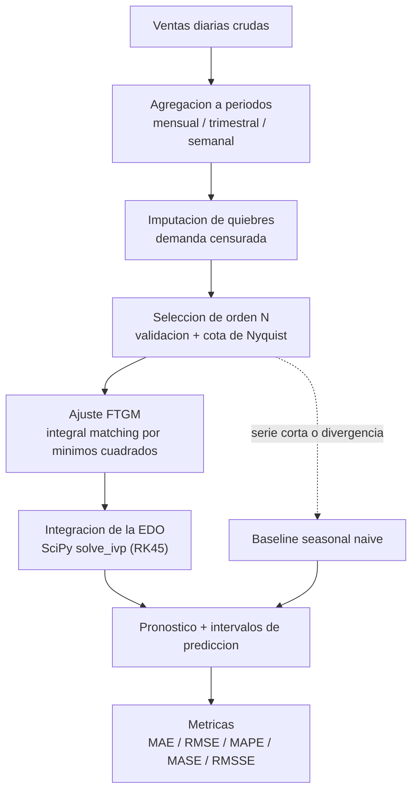

# Inventory DSS FTGM Engine

Servicio analítico externo de la plataforma **Inventory Optimization DSS Platform**.

Este repositorio contiene el motor de predicción de demanda basado en el **Fourier
Time-Varying Grey Model (FTGM)**. Recibe series temporales preparadas desde el backend,
ejecuta el modelo y devuelve pronósticos de demanda con intervalos de predicción y
métricas de evaluación.

El motor implementa la formulación integral (Apéndice A) del artículo:

> Ye, L., Xie, N., Boylan, J. E., & Shang, Z. (2024). *Forecasting seasonal demand for
> retail: A Fourier time-varying grey model.* International Journal of Forecasting.
> https://doi.org/10.1016/j.ijforecast.2023.12.006

Para el detalle técnico y la lógica de implementación, ver
[`docs/README.md`](docs/README.md).

---

## Rol dentro del sistema

| Repositorio                 | Responsabilidad                            |
| --------------------------- | ------------------------------------------ |
| `inventory-dss-web`         | Frontend Next.js                           |
| `inventory-dss-api`         | Backend FastAPI monolito modular hexagonal |
| `inventory-dss-ftgm-engine` | Motor analítico FTGM desacoplado           |
| `inventory-dss-infra`       | Infraestructura y despliegue               |
| `inventory-dss-docs`        | Documentación académica y arquitectónica   |

El backend consume este servicio por HTTP/REST/JSON a través de un FTGM Adapter:

```text
inventory-dss-api  ->  FTGM Adapter  ->  inventory-dss-ftgm-engine  ->  Forecast + Metrics
```

## Qué hace este servicio

- Recibe series temporales por producto (lote).
- Agrega los datos a la frecuencia estacional configurada.
- Repara periodos con quiebre de stock (demanda censurada).
- Selecciona el orden de Fourier de forma automática.
- Ejecuta el FTGM y produce pronóstico con intervalos de predicción.
- Calcula métricas de exactitud (MAE, RMSE, MAPE, MASE, RMSSE).
- Cae a un baseline (seasonal naive) si la serie es insuficiente o el modelo diverge.

## Qué no hace este servicio

No maneja usuarios, empresas, roles, permisos, inventario transaccional, ventas como
entidad de negocio, pagos, suscripciones, dashboards, reportes ni notificaciones. Esas
responsabilidades pertenecen al backend.

---

## Cómo funciona (vista general)



La idea en una frase: el FTGM es un grey model (preciso con pocos datos) cuyos dos
parámetros varían en el tiempo mediante series de Fourier, para capturar estacionalidad
y crecimiento que cambian a lo largo del año.

---

## Arquitectura

El código sigue una separación por capas. El núcleo numérico (`app/ftgm`) no depende de
FastAPI ni de pydantic, por lo que puede probarse y reutilizarse de forma aislada.

```text
app/
  ftgm/                  Nucleo numerico puro (sin dependencias web)
    fourier.py           Base de Fourier y parametros variables a(t), b(t)
    model.py             Clase FTGM: ajuste (minimos cuadrados) + EDO (SciPy)
    order_selection.py   Seleccion del orden de Fourier (Algoritmo 1)
    metrics.py           MAE, RMSE, MAPE, MASE, RMSSE
    preprocessing.py     Agregacion e imputacion de quiebres
    exceptions.py        Errores de dominio
  baselines/
    seasonal_naive.py    Modelo de referencia para comparacion
  application/
    forecast_service.py  Orquesta el pipeline por producto (lote)
  presentation/
    schemas.py           Contrato HTTP (request/response)
    router.py            Endpoints
  config.py              Configuracion (pydantic-settings)
  main.py                Punto de entrada FastAPI
tests/                   Pruebas unitarias, de servicio y validacion con datos M5
docs/                    Documentacion tecnica y datos de referencia del paper
```

---

## Contrato HTTP

### `POST /api/v1/forecast`

Solicitud (lote de productos):

```json
{
  "model": "FTGM",
  "period": 12,
  "horizon": 6,
  "series": [
    {
      "product_id": "11111111-1111-1111-1111-111111111111",
      "points": [
        { "date": "2023-01-01", "demand": "120.0", "stockout_flag": false }
      ]
    }
  ]
}
```

- `period`: periodo estacional T (12 = mensual, 4 = trimestral, 52 = semanal).
- `horizon`: número de periodos a pronosticar.
- `stockout_flag`: marca de quiebre de stock para imputar la demanda censurada.

Respuesta:

```json
{
  "period": 12,
  "forecasts": [
    {
      "product_id": "11111111-1111-1111-1111-111111111111",
      "model": "FTGM",
      "order_selected": 3,
      "points": [
        {
          "date": "2024-01-01",
          "predicted_demand": 138.2,
          "lower_bound": 120.5,
          "upper_bound": 155.9
        }
      ],
      "metrics": { "mae": 8.1, "rmse": 10.4, "mape": 6.7, "mase": 0.62, "rmsse": 0.58 }
    }
  ]
}
```

- `order_selected`: orden de Fourier elegido; `0` indica que se usó el baseline.
- Las métricas son in-sample (calidad de ajuste). Pueden ser `null` cuando no están
  definidas (por ejemplo, MAPE sobre demanda totalmente cero).

### `GET /api/v1/health`

```json
{ "status": "ok", "service": "inventory-dss-ftgm-engine" }
```

---

## Instalación y ejecución

Requiere Python 3.11+.

```bash
python -m venv .venv
.venv\Scripts\activate          # Windows
pip install -e .                # instala el proyecto y sus dependencias

uvicorn app.main:app --port 8010 --reload
```

La URL base (`/api/v1`) y el puerto deben coincidir con `ftgm_engine_base_url` en el
backend. Variables de entorno disponibles en `.env.example`.

---

## Pruebas y calidad

```bash
pip install -e ".[dev]"

pytest           # 21 pruebas: unidad, servicio end-to-end y validacion con datos M5 reales
ruff check app   # estilo
mypy app         # tipos (modo strict)
```

La suite incluye una validación sobre series reales del M5 (en `docs/ftgmmodel`): el
modelo ajusta de forma estable y supera al baseline seasonal naive en la mayoría de las
series.

---

## Referencia académica

Ye, L., Xie, N., Boylan, J. E., & Shang, Z. (2024). *Forecasting seasonal demand for
retail: A Fourier time-varying grey model.* International Journal of Forecasting.
Repositorio original de los autores: https://github.com/yll-66/ftgmmodel
