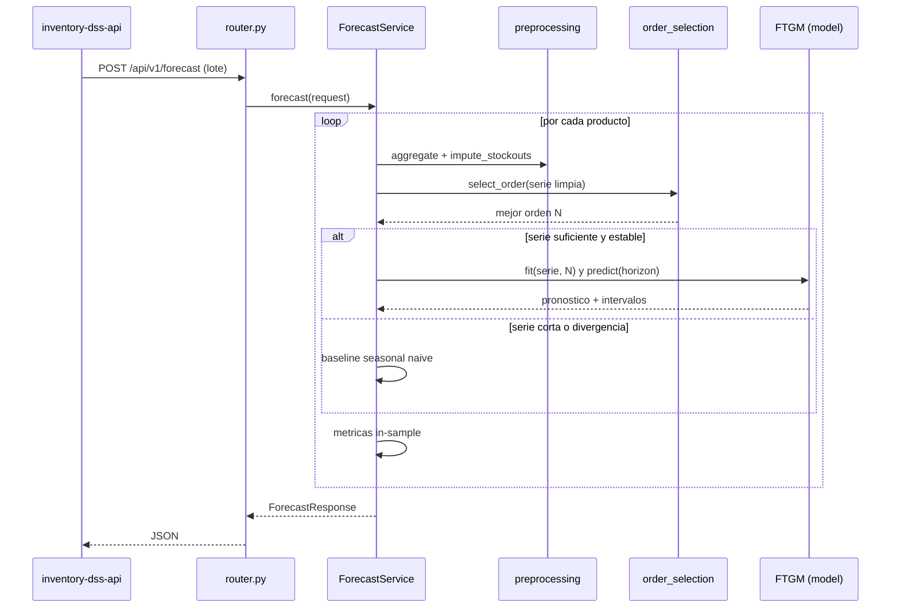
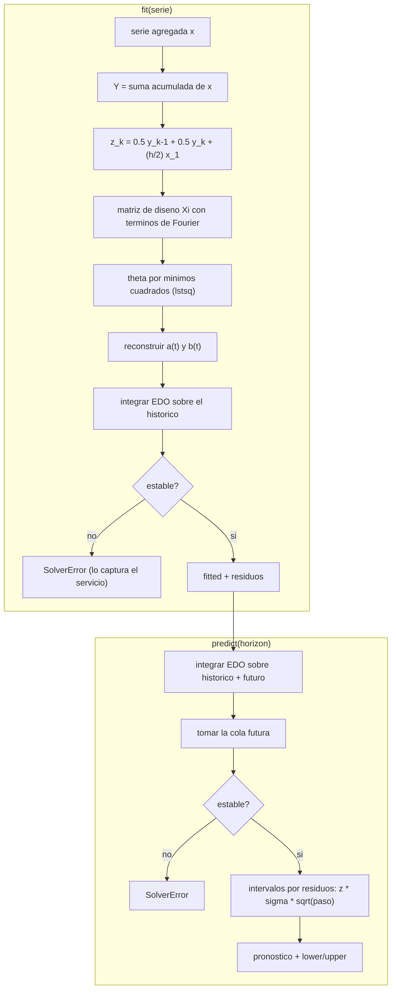

# FTGM Engine — Documentación técnica

Este documento describe, a nivel de lógica e implementación, cómo está construido el
motor FTGM: cómo se traduce el modelo del artículo a código, cómo fluye una solicitud y
qué hace cada módulo. Para la guía general de uso, ver el
[README principal](../README.md).

Referencia: Ye, L., Xie, N., Boylan, J. E., & Shang, Z. (2024). *Forecasting seasonal
demand for retail: A Fourier time-varying grey model.* International Journal of
Forecasting.

---

## 1. El modelo en tres ideas

El FTGM combina tres conceptos. Entender estos tres es entender el modelo completo.

1. **Grey model.** En lugar de modelar la demanda cruda (ruidosa), se trabaja sobre su
   suma acumulada, que es suave y casi exponencial. Esto permite ajustar con muy pocos
   datos, donde métodos como ARIMA o redes neuronales se sobreajustan.
2. **Parámetros variables en el tiempo.** El grey model clásico tiene dos constantes: un
   coeficiente de desarrollo `a` (tasa de crecimiento) y un término forzante `b` (empuje
   de base). El FTGM permite que ambos cambien con el tiempo, `a(t)` y `b(t)`, para
   capturar estacionalidad y tendencia que varían a lo largo del año.
3. **Series de Fourier.** `a(t)` y `b(t)` se escriben como suma de senos y cosenos en la
   frecuencia estacional y sus armónicos. El número de armónicos (orden `N`) controla la
   complejidad de la forma estacional.

La innovación del artículo, frente a grey models estacionales previos, es modelar la
serie original de forma directa con una ecuación integro-diferencial de orden reducido,
y estimar los parámetros con *integral matching* (que estabiliza la estimación al
trabajar con integrales en lugar de derivadas).

---

## 2. Del artículo al código

La implementación usa la forma integral limpia (Apéndice A del artículo), equivalente a
la referencia MATLAB de los autores pero más simple y legible.

| Concepto del artículo                                  | Dónde está en el código                         |
| ------------------------------------------------------ | ----------------------------------------------- |
| Suma acumulada Y(t) (Ec. 1-2)                          | `model.fit` → `np.cumsum`                       |
| Parámetros de Fourier a(t), b(t) (Ec. 6-7)             | `fourier.evaluate_parameters`                   |
| Término z(t_k) (Ec. 12)                                | `model.fit` → variable `z`                      |
| Matriz de diseño Ξ (Ec. 13-14)                         | `fourier.design_matrix`                         |
| Estimación θ por mínimos cuadrados (Ec. 15)            | `model.fit` → `np.linalg.lstsq`                 |
| Ecuación integral y valor inicial (Ec. A.6)            | `model._integrate`                              |
| Solución numérica con Runge-Kutta (ode45 / solve_ivp)  | `model._integrate` → `scipy.integrate.solve_ivp`|
| Selección de orden por validación (Algoritmo 1)        | `order_selection.select_order`                  |
| Cota de Nyquist N < T / (2h)                           | `order_selection._nyquist_cap`                  |
| Métricas RMSE / MASE / RMSSE (Ec. 32-34)               | `metrics.py`                                    |

Nota sobre la referencia MATLAB: las funciones `odefcn` que el código MATLAB invoca no
están incluidas en `docs/ftgmmodel/utils`. No se necesitan, porque el Apéndice A reduce
todo a una sola ecuación diferencial de primer orden que se integra directamente.

---

## 3. Flujo de una solicitud

---

## 4. Lógica interna del ajuste y el pronóstico

Detalle del ajuste (`model.fit`):

1. Construye la suma acumulada `Y` de la serie agregada.
2. Calcula `z_k`, que es la versión discreta de `x(t_1) + integral de x`.
3. Arma la matriz de diseño `Ξ` con los términos de Fourier (esto convierte la ecuación
   del modelo en una regresión lineal en los parámetros).
4. Resuelve `θ` por mínimos cuadrados. Se usa `lstsq` (solución de norma mínima) en lugar
   de invertir `ΞᵀΞ`, por estabilidad numérica.
5. Integra la EDO sobre el histórico para obtener el ajuste in-sample y los residuos.
6. Verifica que el ajuste no diverja (los grey models son exponenciales y un orden
   sobreajustado puede explotar). Si diverge, levanta `SolverError`.

Detalle del pronóstico (`model.predict`):

1. Integra la misma EDO sobre el histórico más el horizonte futuro, en un solo paso, y
   toma la cola futura.
2. Verifica estabilidad y recorta valores negativos (la demanda no puede ser negativa).
3. Construye el intervalo de predicción a partir de la desviación de los residuos.

---

## 5. Módulo por módulo

### `ftgm/preprocessing.py`
- `aggregate`: agrupa observaciones diarias en cubos estacionales (mes, trimestre o
  semana) y rellena huecos de calendario con ceros, garantizando una serie contigua y
  equiespaciada (requisito del modelo).
- `impute_stockouts`: reemplaza los periodos marcados como quiebre por interpolación
  lineal, porque un quiebre es demanda censurada (no se pudo vender lo que no había), no
  demanda baja real.
- `future_period_dates`: genera las fechas de los periodos futuros del pronóstico.

### `ftgm/fourier.py`
- `harmonics`: matriz de cosenos y senos por instante de tiempo.
- `design_matrix`: la matriz `Ξ` de integral matching (Ec. 13-14).
- `evaluate_parameters`: reconstruye `a(t)` y `b(t)` continuos a partir de `θ`.
- `angular_frequency`: `w = 2π / T`.

### `ftgm/model.py`
La clase `FTGM` (ajuste, pronóstico, intervalos y guardas de divergencia) y `FTGMConfig`
(periodo, tolerancias del solver, z del intervalo, factor de divergencia). Es código puro
de NumPy/SciPy, sin dependencias web.

### `ftgm/order_selection.py`
`select_order` implementa el Algoritmo 1: separa un conjunto de validación, prueba cada
orden candidato (acotado por Nyquist y por la cantidad de datos), y elige el de menor
RMSE de validación. Los órdenes que divergen se descartan automáticamente.

### `ftgm/metrics.py`
Dos familias: dependientes de escala (`MAE`, `RMSE`, en unidades de demanda) e
independientes de escala (`MAPE`, `MASE`, `RMSSE`, comparables entre productos). MASE y
RMSSE son las métricas del M5 usadas en el artículo.

### `baselines/seasonal_naive.py`
Repite el último ciclo estacional observado. Es el punto de comparación honesto: si el
FTGM no lo supera, algo está mal.

### `application/forecast_service.py`
Orquesta el pipeline por producto en lote. Si una serie es demasiado corta o el modelo
diverge, cae de forma transparente al baseline (`order_selected = 0`).

### `presentation/`
`schemas.py` define el contrato HTTP (request/response) y `router.py` expone los
endpoints `/forecast` y `/health`.

---

## 6. Decisiones de diseño

- **Forma integral (Apéndice A) en lugar de réplica del MATLAB.** Equivalente
  teóricamente, más legible y sin dependencia de las funciones `odefcn` faltantes.
- **`lstsq` en lugar de invertir `ΞᵀΞ`.** Evita problemas numéricos cuando la matriz está
  mal condicionada (series cortas, alta colinealidad de armónicos).
- **Guardas de divergencia + fallback.** Buena práctica de un sistema predictivo: nunca
  devolver valores no finitos; degradar a un baseline conocido.
- **Frecuencia configurable.** `period` viaja en la solicitud (mensual por defecto). El
  backend traduce el horizonte en días a número de periodos.
- **Intervalos por residuos.** El FTGM no tiene distribución predictiva nativa; se usa una
  banda `z * sigma * sqrt(paso)`, simple y defendible, que crece con el horizonte.
- **Núcleo numérico aislado.** `app/ftgm` no importa FastAPI ni pydantic, por lo que es
  testeable y reutilizable de forma independiente.

---

## 7. Limitaciones y trabajo futuro

- **Tamaño mínimo de muestra.** El modelo necesita al menos dos ciclos estacionales para
  rendir bien. Con menos datos, el servicio usa el baseline.
- **Sensibilidad a outliers y quiebres.** Por eso la etapa de preparación de datos es
  crítica; la imputación de quiebres ya está incluida.
- **Evaluación rolling-origin.** El artículo evalúa con origen deslizante; aquí las
  métricas son in-sample. Añadir rolling-origin reforzaría la sección de evaluación de la
  tesis.
- **Comparación ampliada.** Solo se incluye un baseline (seasonal naive); se pueden añadir
  GM(1,1) o Holt-Winters para una comparación más completa.

---

## 8. Cómo validar contra los datos del artículo

En `docs/ftgmmodel` están los datos M5 originales (`sales_data1.csv`, diario). La prueba
`tests/test_paper_data.py` agrega una serie a frecuencia mensual, ajusta el FTGM y
verifica que ajusta de forma estable y supera al baseline en la mayoría de las series.
Es el punto de partida para una comparación numérica más detallada contra la referencia
MATLAB.
